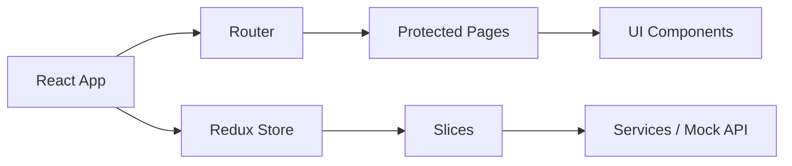

# e-GRCP

Enterprise Governance, Risk, Compliance, and Procurement platform built with React 19 and Vite.

## Overview

This project delivers a polished, enterprise-style frontend experience for managing governance workflows across procurement, vendors, risk, compliance, audits, approvals, notifications, reports, and settings. The implementation uses Redux Toolkit for centralized state, React Router for protected navigation, Material UI for the shell and data surfaces, and Recharts for analytics views.

## Verified status

The current project has been verified with:

- Build: `npm run build`
- Tests: `npm run test:run`

## Core capabilities

- Authentication and protected routes
- Dashboard with KPI cards and charts
- Procurement request management and details experience
- Vendor directory and detail views
- Risk, compliance, audit, approval, notification, report, and settings modules
- Mock API/service layer and resilient error handling

## Tech stack

- React 19
- Vite 8
- Redux Toolkit + Redux Persist
- React Router DOM
- Material UI
- Axios
- React Hook Form + Yup
- Recharts
- Vitest + Testing Library

## Project structure

```text
src/
  app/         # Redux slices and store
  components/  # Reusable UI modules
  layouts/     # Shell layout and navigation
  mocks/       # Seed data for modules
  pages/       # Route-level screens
  routes/      # Routing and protection
  services/    # API and mock service layer
  tests/       # Automated tests
```

## Quick start

```bash
npm install
npm run dev
```

Open http://localhost:5173 to view the app.

## Build and test

```bash
npm run build
npm run test:run
```

## Deployment

The repository includes a GitHub Pages workflow in [.github/workflows/deploy.yml](.github/workflows/deploy.yml). For local deployment checks, use the same build command above and preview the production output with:

```bash
npm run preview
```

## Architecture snapshot



## Author

Amulya T V